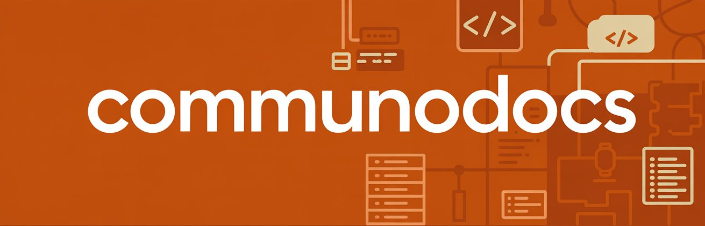

Cet espace est un espace de documentation personnelle à la base... Mais comme dans notre métier le bon état d'esprit est de partager ses connaissances, et que l'entraide est important pour progresser ensemble, j'ai décidé de rendre ce projet public.

N'hésitez pas à faire des retours, à proposer des améliorations, ou même à signaler des erreurs.

Je n'ai aucune prétention, juste envie d'apprendre et de progresser. J'espère arriver au moment où l'ouvrir à contribution aura un sens, pourquoi pas...

Je suis Nico, Lead Tech DevOps chez Kanoma et je vais partager cet espace avec des amis et collègues pour documenter des sujets qui nous passionnent.

Romain, Ingé DevOps chez Kanoma et... d'autres viendront sûrement compléter cet espace au fil du temps.